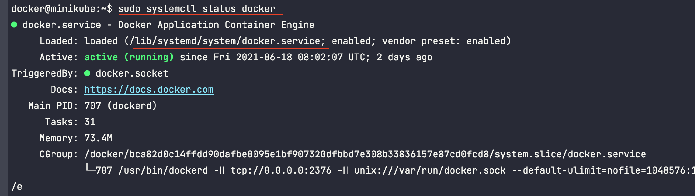
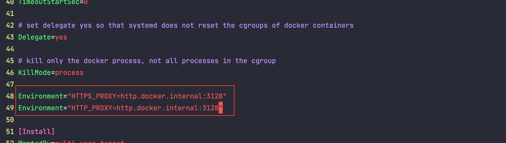

# HELLO DOCKER

## TroubleShooting

### `Init:ImagePullBackOff`

如果  `kubectl describe pod pod-instance-name` 中有如下输出:
```plaintext
  Warning  Failed     35m (x4 over 37m)      kubelet            Failed to pull image "gitlab/gitlab-runner:alpine-v13.12.0": rpc error: 
  code = Unknown desc = Error response from daemon: Get https://registry-1.docker.io/v2/: proxyconnect 
  tcp: dial tcp 127.0.0.1:1087: connect: connection refused
```

#### 解决方案：
##### 1. `sudo systemctl status docker` 
查看docker service 配置文件地址


##### 2. `sudo vim /lib/systemd/system/docker.service`
在`[Service]`下添加: 
   
```shell
Environment="HTTPS_PROXY=http.docker.internal:3128"
Environment="HTTP_PROXY=http.docker.internal:3128"
```



###### 3. `sudo systemctl daemon-reload`
   
###### 4. `sudo systemctl restart docker`
