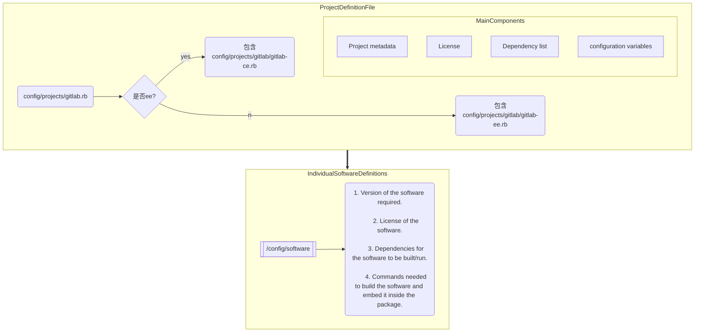
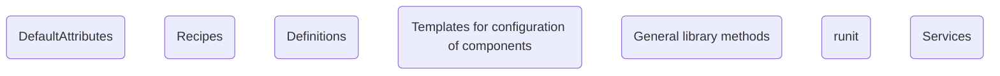

# Omnibus GitLab 笔记

### 什么是Omnibus

    Omnibus GitLab, as previously described, 
    uses many of the Chef components like cookbooks, attributes, and resources. 
    GitLab EE uses a separate cookbook that extends from the one GitLab CE uses and adds the EE-only components.

**`cookbook`的方式用来集成我们gitcode的新UI？**

### Omnibus-gitlab 代码仓库地址

https://gitlab.com/gitlab-org/omnibus-gitlab.git

### Omnibus GitLab 结构和组成


### 配置从哪拉取gitlab的代码 及其他组件

代码仓 => `.custom_sources.yml`

在打omnibus包的时候可以指定前端包的文件夹位置 [参考文档地址](https://docs.gitlab.com/omnibus/build/build_package.html)

### 打包 all-in-one Docker image

#### 什么是all_in_one打包 ? 和普通omnibus-gitlab打包的区别？

* 都需要用docker来打包
* 普通打包会自动识别os来判断要打包的类型
* all-in-one 用了在ubuntu20.04环境下的包，适用于ci环境

文档的解释：`The GitLab all-in-one Docker image uses the omnibus-gitlab package built for Ubuntu 20.04 under the hood. The Dockerfile is optimized to be used in a CI environment, with the expectation of packages being available over the Internet.`

#### 查看仓库docker目录下的内容

#### 其他需要注意

```shell
# 打包
cd docker
docker build -t omnibus-gitlab-image:custom .
```

### 添加新的依赖

https://docs.gitlab.com/omnibus/development/new-software-definition.html

包含如何测试添加的依赖、重新打包

### 工作内容

* 将 [omnibus-gitlab](https://gitlab.com/gitlab-org/omnibus-gitlab) 下 `.custom_sources.yml`
  中所有的镜像源放到了组织 [https://gitcode.net/gitcode-dev/](https://gitcode.net/gitcode-dev/) 中
  `bundle exec omnibus build gitlab --log-level info`

#### 在哪儿判断是ee打包？

    Omnibus GitLab is a customized fork of the Omnibus project from Chef, and it uses Chef components like cookbooks and recipes to perform the task of configuring GitLab in a user's computer. Omnibus GitLab repository on GitLab.com hosts all the necessary components of Omnibus GitLab. These include parts of Omnibus that is required to build the package, like configurations and project metadata, and the Chef related components that will be used in a user's computer after installation.

`chef` 组件会在安装完成后用到

入口文件`config/projects/gitlab.rb` [project definition file](https://gitlab.com/gitlab-org/omnibus-gitlab/blob/master/config/projects/gitlab.rb)
：介绍了要加载哪些组件依赖，包括判断是否**ee环境**打包



#### Global GitLab configuration template

`files/gitlab-config-template/gitlab.rb.template`加入gitcode自定义添加的配置

### GitLab Cookbook
    Omnibus GitLab uses many of the Chef components like cookbooks, attributes, and resources. GitLab EE uses a separate cookbook that extends from the one GitLab CE uses and adds the EE-only components.

#### 组成


#### DefaultAttributes（默认值）

`files/gitlab-cookbooks/gitlab/attributes/default.rb`

形如：
```ruby
####
# The Git User that services run as
####
# The username for the chef services user
default['gitlab']['user']['username'] = "git"
default['gitlab']['user']['group'] = "git"
default['gitlab']['user']['uid'] = nil
default['gitlab']['user']['gid'] = nil
# The shell for the chef services user
default['gitlab']['user']['shell'] = "/bin/sh"
# The home directory for the chef services user
default['gitlab']['user']['home'] = "/var/opt/gitlab"
default['gitlab']['user']['git_user_name'] = "GitLab"
default['gitlab']['user']['git_user_email'] = "gitlab@#{node['fqdn']}"

```

存放gitlab不同组件(`user` \ `gitlab-rails` \ `puma` \ `sidekiq` \ `web-server` \ `gitlab-workhorse` \ `nginx` \ `logging` \ `remote-syslog` \ `gitlab-ci` \ `pages-nginx` \ `registry-nginx`  \ `storage-check` )的默认配置值

#### Recipes（食谱）

`files/gitlab-cookbooks/gitlab/recipes/`

在安装时会用到，负责在用户主机上奢姿gitlab各个组件的生态系统，创建必要的目录、文件和软连接，设置权限、所有者、配置，启动或关停必要的服务（在配置文件变动时通知对应服务）
master recipe是default.rb: 这个是入口，建立了和其他食谱之间的联系

#### Definitions

`files/gitlab-cookbooks/gitlab/definitions` (备注：在master分支上为空)
跨越不同Recipes的全局宏指令，比如定义一个端口号，多被用在不同recipes之间复用变量

#### Templates for configuration of components

`files/gitlab-cookbooks/gitlab/templates/default/`

比如`files/gitlab-cookbooks/gitlab/templates/default/database.yml.erb`，存放配置文件的模版，模版里的值会从`DefaultAttributes`读取

#### General library methods

`files/gitlab-cookbooks/gitlab/libraries/gitlab_rails.rb`

通用库方法，主要用于代码复用，比如服务起来后，库方法检查文件的存在，helper方法去和不同组件交互。通常被用在`Chef recipes`

#### runit

    runit是一种类Unix操作系统的init方案，可在整个操作系统运行时初始化、监视及终止进程。runit是可在Linux、Mac OS X、*BSD和Solaris操作系统上运行的、有“开创性”的daemontools的“再实现”。runit可并行启动系统服务，这样可以加快操作系统的启动。如System V init，runit是所有其他进程直接或间接的父进程。它是在启动过程中第一个运行的进程，并继续运行直至系统关闭。


    runit致力于成为一个小型、模块化、可移植的代码库。runit分为三个阶段：一次性的初始化，进程监视，及停止或重新启动。除了第一和第三阶段必须适应所运行的特定操作系统外，第二阶段在所有POSIX兼容的操作系统都可方便移植

  详见`/files/gitlab-cookbooks/runit`

  https://gitlab.com/gitlab-org/omnibus-gitlab/-/tree/master/files/gitlab-cookbooks/runit

perform basic service management tasks like creating necessary service files for GitLab, service enabling, and service reloading.

执行基本的服务管理任务，比如创建必要的gitlab服务文件、服务enable，服务重启

#### Services

`files/gitlab-cookbooks/package/libraries/config/services.rb`

用`gitlab-ctl`命令控制服务的状态、启动、停止、从起

```ruby
require_relative '../helpers/services_helper.rb'

module Services
  # Define the services included in every GitLab Edition
  class BaseServices < ::Services::Config
    # Define all gitlab cookbook services
    service 'logrotate',          groups: [DEFAULT_GROUP, SYSTEM_GROUP]
    service 'node_exporter',      groups: [DEFAULT_GROUP, SYSTEM_GROUP, 'monitoring', 'monitoring_role']
    service 'puma',               groups: [DEFAULT_GROUP, 'rails']
    service 'sidekiq',            groups: [DEFAULT_GROUP, 'rails', 'sidekiq', 'sidekiq_role']
    service 'gitlab_exporter',    groups: [DEFAULT_GROUP, 'rails', 'monitoring']
    service 'gitlab_workhorse',   groups: [DEFAULT_GROUP, 'rails']
    service 'gitaly',             groups: [DEFAULT_GROUP, 'rails']
    service 'redis',              groups: [DEFAULT_GROUP, 'redis', 'redis_node']
    service 'redis_exporter',     groups: [DEFAULT_GROUP, 'redis', 'redis_node', 'monitoring']
    service 'postgresql',         groups: [DEFAULT_GROUP, 'postgres', 'postgres_role', 'patroni_role']
    service 'nginx',              groups: [DEFAULT_GROUP, 'pages_role']
    service 'prometheus',         groups: [DEFAULT_GROUP, 'monitoring', 'monitoring_role']
    service 'alertmanager',       groups: [DEFAULT_GROUP, 'monitoring', 'monitoring_role']
    service 'postgres_exporter',  groups: [DEFAULT_GROUP, 'monitoring', 'postgres', 'postgres_role', 'patroni_role']
    service 'grafana',            groups: [DEFAULT_GROUP, 'monitoring', 'monitoring_role']
    service 'gitlab_pages',       groups: ['pages_role']
    service 'mailroom'
    service 'gitlab_kas'
    service 'mattermost'
    service 'registry'
    service 'storage_check'
    service 'crond'
    service 'praefect'
  end

  # Define the services included in the EE edition of GitLab
  class EEServices < ::Services::Config
    service 'sentinel',           groups: ['redis']
    service 'geo_logcursor',      groups: ['geo']
    service 'geo_postgresql',     groups: %w(geo postgres)
    service 'pgbouncer',          groups: %w(postgres pgbouncer_role)
    service 'pgbouncer_exporter', groups: %w(pgbouncer_role monitoring)
    service 'patroni',            groups: %w(postgres patroni_role)
    service 'consul',             groups: %w(consul_role ha pgbouncer_role patroni_role)
  end
end
```

### `gitlab-ctl` Commands

https://gitlab.com/gitlab-org/omnibus-gitlab/tree/master/files/gitlab-ctl-commands


## Omnibus Gitlab 生命周期

### 包编译时会发生什么

编译时将会生成对应操作系统类型的包，比如在`Debian`编译，那么将生成`.deb`包

编译过程可以分为以下几个步骤：

1. 拉取依赖软件源

    i.解析software definitions找到对应版本

    ii. 从remotes或缓存获取源码
2. 编译各个软件组件

    i.设置必要的环境变量和flags

    ii.应用patches补丁（如果有必要）

    iii.执行编译安装组件的程序，这涉及到安装到正确的位置(:在`/opt/gitlab`目录下)
3. 对所有打包的组件生成license信息(包括外部软件，ruby gems，Js modules)
4. 检查各个组件的license，确保没有不兼容的license
5. 运行包健康检查程序
6. 对`/opt/gitlab`下的内容打包,将会用到`gitlab.rb`文件中的元数据，包含包名，版本，维护者，主页

### 缓存

为优化编译进程Omnibus有两种类型的缓存：

    一是存储软件产物（依赖软件包的资源）
    二是存储各个软件组件编译完之后的项目树[原文 project tree], 类似于git的commit号

具体可参考 `/doc/architecture/index.md#Cache`

### 执行`gitlab-ctl reconfigure`时会发生什么

`gitlab-ctl reconfigure` 是一个常用命令，简单讲，就是解析配置文件，运行各个recipes（菜谱）中的值

The recipes to be run are defined in a file called `dna.json` present in the embedded folder inside the installation directory (This file is generated by a software dependency named gitlab-cookbooks that's defined in the software definitions). 

    A Chef cookbook can contain multiple Chef recipes. 
拿GitLab CE来讲，`gitlab`的cookbook 将会被选为主菜谱，这将会创建所有必要的食谱，包括runit。简短说，reconfigure 是一个基础的chef-client，它通过加载配置模版运行了不同的配置文件和服务。


## Question Mark: 什么是Chef？

**Q**:   What is the difference between a cookbook and a recipe in Chef (DevOps)?

**A**:  Chef cookbook follows a definite directory structure, where as Chef recipes are the Ruby scripts that can be executed by Chef client.
A Chef cookbook can contain multiple Chef recipes. You cannot run the Chef cookbook, but the Chef recipe. To run a Chef recipe, you need to call cookbook_name::recipe_name.


## 编译

`/opt/gitlab/embedded/bin/bundle install --without development test mysql --jobs 7 --retry 5`
