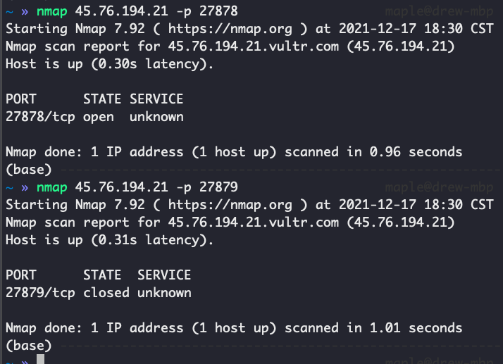

# Basic

## check if a port is open on a remote linux pc

Nmap command is popular network security, auditing, and exploration command. Nmap stands for Network Mapper.

It also has a way to check for open ports. To do so, it utilizes a novel approach to using IP packets. It can also be used to learn about the services the host is providing. Other vital aspects that it can detect include operating system version, packet firewalls/filters, and so on! It is a useful tool.

Let’s see the nmap syntax below.

`nmap [-options] [IP or Hostname] [-p] [PortNumber]
`

As you can see, its syntax matches that of the nc command. Let’s run it to get a better understanding.

`nmap 192.168.0.1 -p 22`

