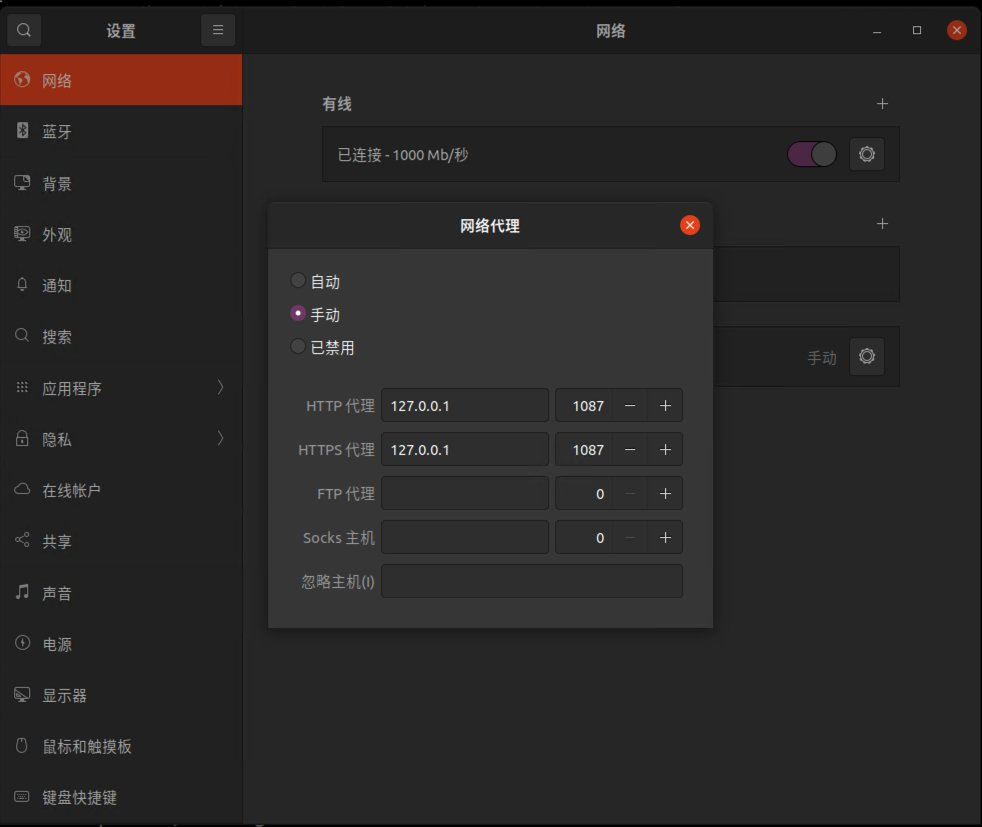

# Hello Network

## Shadowsocks-libev

### Ubuntu 客户端配置

[shadowsocks-libev github仓库地址](https://github.com/shadowsocksrr/shadowsocksr-libev)

#### 安装 shadowsocks-lib

```shell
sudo apt update
sudo apt install shadowsocks-libev
```
#### 修改配置文件

```shell
# Edit the configuration file
sudo vim /etc/shadowsocks-libev/config.json

# Edit the service configuration file 
# Change `ExecStart=/usr/bin/ss-server -c $CONFFILE $DAEMON_ARGS` to `ExecStart=/usr/bin/ss-local -c $CONFFILE $DAEMON_ARGS`
# 修改 ss-server 为 ss-local
sudo vim /lib/systemd/system/shadowsocks-libev.service
```

#### 启动服务
```sh
# Reload 修改的服务、重启shadowsocks-libev服务
sudo systemctl daemon-reload
sudo service shadowsocks-libev restart

# Check service status
sudo service shadowsocks-libev status

# Check shadowsocks-libev port is alive
sudo lsof -i:10801
```

### Kcptun

### Ubuntu 客户端配置

[kcptun github仓库地址](https://github.com/xtaci/kcptun)

#### Install

```sh
# 下载包（推荐去github仓库地址下载最新版本）
wget https://github.com/xtaci/kcptun/releases/download/v20210922/kcptun-linux-amd64-20210922.tar.gz

# 解压缩
tar -zxvf kcptun-linux-amd64-20210922.tar.gz

sudo mv client_linux_amd64 /usr/local/bin/kcptun_client

sudo bash -c "cat <<EOT > /etc/kcptun/client_conf.json
{
    \"localaddr\": \":29001\",
    \"remoteaddr\": \"[remote_server_ip]:[remote_kcp_port]\",
    \"mode\": \"fast3\",
    \"dscp\": 46,
    \"crypt\": \"aes\",
    \"key\": \"password\",
    \"datashard\": 10,
    \"parityshard\": 3,
    \"mtu\": 1350,
    \"sndwnd\": 1024,
    \"rcvwnd\": 1024
}
EOT"

sudo bash -c "cat <<EOT > /etc/systemd/system/kcptun_client.service
[Unit]
Description=Kcptun client
Requires=network.target
After=network-online.target
    
[Service]
Type=simple
User=nobody
RemainAfterExit=yes
ExecStart=/usr/local/bin/kcptun_client -c /etc/kcptun/client_conf.json
ExecReload=/usr/bin/kill -HUP $MAINPID
RestartSec=1min
Restart=on-failure
    
[Install]
WantedBy=multi-user.target
EOT"


sudo systemctl enable kcptun_client

sudo systemctl start kcptun_client

# 查看状态
sudo service kcptun_client status
```

## Privoxy 配置代理到终端
配置代理到终端需要用到：
https://www.privoxy.org/user-manual/index.html

### Ubuntu install privoxy
```sh
sudo apt install -y privoxy
```

### Config
```sh
sudo vim /etc/privoxy/config
```

add this to tail:
```txt
listen-address  127.0.0.1:1087
listen-address  [::1]:1087

forward         192.168.*.*/     .
forward         10.*.*.*/        .
forward         127.*.*.*/       .
forward         [FE80::/64]      .
forward         [::1]            .
forward         [FD00::/8]       .
forward-socks5 / 127.0.0.1:10801 .
```

```sh
# 重启服务
sudo service restart privoxy
```

## 终端里使用proxy

```sh
# 开启
export http_proxy=http://127.0.0.1:1087;export https_proxy=http://127.0.0.1:1087;

# 关闭
unset http_proxy && unset https_proxy
```

## Ubuntu 图形界面使用proxy



## 检查端口是否开放 (Check if a port is open)

Nmap command is popular network security, auditing, and exploration command. Nmap stands for Network Mapper.

It also has a way to check for open ports. To do so, it utilizes a novel approach to using IP packets. It can also be used to learn about the services the host is providing. Other vital aspects that it can detect include operating system version, packet firewalls/filters, and so on! It is a useful tool.

Let’s see the nmap syntax below.

`nmap [-options] [IP or Hostname] [-p] [PortNumber]`

As you can see, its syntax matches that of the nc command. Let’s run it to get a better understanding.

`nmap 192.168.0.1 -p 22`


